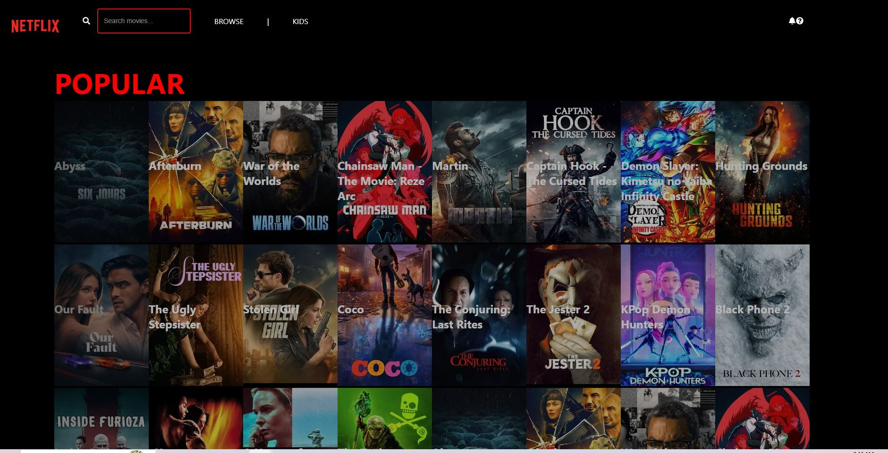

# Netflix Clone

A Netflix-inspired movie browsing application built with React. Browse popular movies with an infinite scroll feature and search functionality.



## Features

- 🎬 **Browse Popular Movies** - Displays trending movies from The Movie Database (TMDb) API
- 🔍 **Real-time Search** - Filter movies by title with instant results
- ♾️ **Infinite Scroll** - Seamlessly loads more content as you scroll
- 🎨 **Hover Effects** - Interactive movie posters with smooth animations
- 📱 **Responsive Design** - Netflix-inspired UI with modern styling
- ⚡ **Optimized Performance** - Built with React 18 and modern tooling

## Technologies Used

- **React 18** - Modern React with hooks and concurrent features
- **Axios** - HTTP client for API requests
- **React Icons** - Icon library (Font Awesome)
- **React Infinite Scroll Component** - Infinite scrolling functionality
- **TMDb API** - Movie data from The Movie Database

## Getting Started

### Prerequisites

- Node.js (v14 or higher)
- npm or yarn

### Installation

1. Clone the repository:
```bash
git clone <repository-url>
cd netflix
```

2. Install dependencies:
```bash
npm install
```

3. Start the development server:
```bash
npm start
```

4. Open [http://localhost:3000](http://localhost:3000) to view it in the browser.

## Available Scripts

### `npm start`

Runs the app in development mode. The page will reload if you make edits.

### `npm test`

Launches the test runner in interactive watch mode.

### `npm run build`

Builds the app for production to the `build` folder. The build is optimized for the best performance.

## Features in Detail

### Search Functionality
- Click the search icon in the navigation bar to reveal the search input
- Type any movie title to filter results in real-time
- Case-insensitive search across all loaded movies

### Movie Grid
- Smooth fade-in animations for each movie poster
- Hover effect with scale transformation and enhanced visibility
- Displays movie titles on hover

### Infinite Scroll
- Automatically loads more movies as you scroll down
- Loading spinner indicator
- Seamless content loading experience

## API Configuration

This project uses The Movie Database (TMDb) API. The API key is included in the source code for demonstration purposes.

## Browser Support

- Chrome (latest)
- Firefox (latest)
- Safari (latest)
- Edge (latest)

## Troubleshooting

### Error: digital envelope routines::unsupported

If you encounter this error, make sure you're using:
- `react-scripts` version 5.0.1 or higher
- Node.js version 14 or higher

This project has been updated to work with modern Node.js versions.

## License

This project was bootstrapped with [Create React App](https://github.com/facebook/create-react-app).

## Acknowledgments

- Movie data provided by [The Movie Database (TMDb)](https://www.themoviedb.org/)
- Inspired by Netflix's user interface
